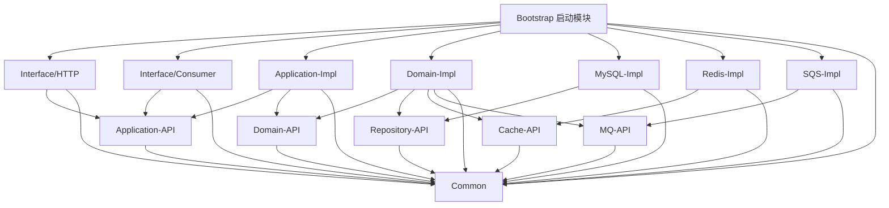

# 设计文档

## 概述

本文档描述了基于 Spring Cloud 的多模块 DDD 架构工程的技术设计方案。该系统采用领域驱动设计（DDD）思想，通过 Maven 多模块工程实现清晰的分层架构，确保技术与业务逻辑解耦，支持微服务化演进。

## 架构设计

### 整体架构

系统采用经典的 DDD 四层架构，从外到内依次为：

```
┌─────────────────────────────────────────────────────────┐
│                    接口层 (Interface)                      │
│              ┌──────────┐      ┌──────────┐             │
│              │   HTTP   │      │ Consumer │             │
│              └──────────┘      └──────────┘             │
└─────────────────────────────────────────────────────────┘
                          ↓
┌─────────────────────────────────────────────────────────┐
│                   应用层 (Application)                   │
│         ┌──────────────┐    ┌──────────────┐           │
│         │ Application  │    │ Application  │           │
│         │     API      │    │     Impl     │           │
│         └──────────────┘    └──────────────┘           │
└─────────────────────────────────────────────────────────┘
                          ↓
┌─────────────────────────────────────────────────────────┐
│                    领域层 (Domain)                       │
│         ┌──────────────┐    ┌──────────────┐           │
│         │   Domain     │    │   Domain     │           │
│         │     API      │    │     Impl     │           │
│         └──────────────┘    └──────────────┘           │
└─────────────────────────────────────────────────────────┘
                          ↓
┌─────────────────────────────────────────────────────────┐
│                基础设施层 (Infrastructure)                │
│  ┌──────────┐  ┌──────────┐  ┌──────────┐             │
│  │Repository│  │  Cache   │  │    MQ    │             │
│  │   API    │  │   API    │  │   API    │             │
│  └──────────┘  └──────────┘  └──────────┘             │
│  ┌──────────┐  ┌──────────┐  ┌──────────┐             │
│  │  MySQL   │  │  Redis   │  │   SQS    │             │
│  │   Impl   │  │   Impl   │  │   Impl   │             │
│  └──────────┘  └──────────┘  └──────────┘             │
└─────────────────────────────────────────────────────────┘

                 ┌──────────────┐
                 │    Common    │
                 │  (通用模块)   │
                 └──────────────┘

                 ┌──────────────┐
                 │  Bootstrap   │
                 │  (启动模块)   │
                 └──────────────┘
```

### 模块依赖关系



## 模块设计

### 1. 父 POM 模块

**职责**：统一管理所有子模块的依赖版本和构建配置

**关键配置**：

```xml
<groupId>com.catface.order</groupId>
<artifactId>order-service</artifactId>
<version>1.0.0-SNAPSHOT</version>
<packaging>pom</packaging>

<properties>
    <java.version>21</java.version>
    <maven.compiler.source>21</maven.compiler.source>
    <maven.compiler.target>21</maven.compiler.target>
    <spring-boot.version>3.3.5</spring-boot.version>
    <spring-cloud.version>2024.0.0</spring-cloud.version>
    <mybatis-plus.version>3.5.7</mybatis-plus.version>
    <aws-sdk.version>2.28.0</aws-sdk.version>
    <logback-json.version>8.0</logback-json.version>
    <micrometer-tracing.version>1.3.5</micrometer-tracing.version>
</properties>
```

**依赖管理策略**：
- 通过 `<dependencyManagement>` 导入 Spring Boot BOM
- 通过 `<dependencyManagement>` 导入 Spring Cloud BOM
- 统一声明第三方库版本（MyBatis-Plus、AWS SDK、Logback JSON Encoder）
- 子模块声明依赖时不指定版本号

### 2. Common 模块

**职责**：提供通用工具类、异常定义、常量和通用 DTO

**包结构**：
```
com.catface.order.common
├── exception
│   ├── BaseException.java
│   ├── BusinessException.java
│   └── SystemException.java
├── dto
│   └── Result.java
├── constant
└── util
```

**核心类设计**：

#### BaseException
```java
@Getter
public abstract class BaseException extends RuntimeException {
    private final String code;
    private final String message;
    
    protected BaseException(String code, String message) {
        super(message);
        this.code = code;
        this.message = message;
    }
}
```

#### BusinessException
```java
public class BusinessException extends BaseException {
    public BusinessException(String code, String message) {
        super(code, message);
    }
}
```

#### SystemException
```java
public class SystemException extends BaseException {
    public SystemException(String code, String message) {
        super(code, message);
    }
}
```

#### Result
```java
@Data
@Builder
@NoArgsConstructor
@AllArgsConstructor
public class Result<T> {
    private String code;
    private String message;
    private T data;
    
    public static <T> Result<T> success(T data) {
        return Result.<T>builder()
            .code("0000")
            .message("success")
            .data(data)
            .build();
    }
    
    public static <T> Result<T> error(String code, String message) {
        return Result.<T>builder()
            .code(code)
            .message(message)
            .build();
    }
}
```

### 3. Domain 层设计

#### Domain-API 模块

**职责**：定义领域模型、聚合根、实体、值对象、领域事件

**包结构**：
```
com.catface.order.domain.api
├── model          # 领域模型
│   ├── aggregate  # 聚合根
│   ├── entity     # 实体
│   └── vo         # 值对象
├── event          # 领域事件
└── service        # 领域服务接口
```

**设计原则**：
- 不依赖任何基础设施层模块
- 只依赖 common 模块
- 定义纯粹的领域概念

#### Domain-Impl 模块

**职责**：实现领域服务逻辑，封装核心业务规则

**包结构**：
```
com.catface.order.domain.impl
└── service        # 领域服务实现
```

**依赖关系**：
- 依赖 domain-api
- 依赖 repository-api、cache-api、mq-api（接口）
- 依赖 common
- 不直接依赖基础设施实现模块

### 4. Infrastructure 层设计

#### Repository 模块

**Repository-API**：
```
com.catface.order.infrastructure.repository.api
└── repository     # 仓储接口定义
```

**MySQL-Impl**：
```
com.catface.order.infrastructure.repository.mysql
├── mapper         # MyBatis-Plus Mapper
├── entity         # 数据库实体（DO）
└── repository     # 仓储接口实现
```

**技术选型**：MyBatis-Plus 3.5.x
- 使用 BaseMapper 简化 CRUD 操作
- 使用 @TableName 映射表名
- 使用 @TableId 定义主键策略

**依赖配置**：
```xml
<!-- MyBatis-Plus -->
<dependency>
    <groupId>com.baomidou</groupId>
    <artifactId>mybatis-plus-boot-starter</artifactId>
</dependency>

<!-- MySQL 驱动 -->
<dependency>
    <groupId>com.mysql</groupId>
    <artifactId>mysql-connector-j</artifactId>
    <scope>runtime</scope>
</dependency>
```

**说明**：
- MyBatis-Plus 版本由父 POM 的 `<dependencyManagement>` 管理
- MySQL 驱动版本由 Spring Boot BOM 管理，无需指定版本号
- MySQL 驱动的 scope 设置为 runtime，因为编译时不需要

#### Cache 模块

**Cache-API**：
```
com.catface.order.infrastructure.cache.api
└── cache          # 缓存接口定义
```

**Redis-Impl**：
```
com.catface.order.infrastructure.cache.redis
├── config         # Redis 配置
└── cache          # 缓存接口实现
```

**技术选型**：Spring Boot Starter Data Redis
- 使用 RedisTemplate 操作 Redis
- 支持序列化配置
- 支持连接池配置

#### MQ 模块

**MQ-API**：
```
com.catface.order.infrastructure.mq.api
└── producer       # 消息生产者接口
```

**SQS-Impl**：
```
com.catface.order.infrastructure.mq.sqs
├── config         # SQS 配置
└── producer       # 消息生产者实现
```

**技术选型**：AWS SDK for SQS 2.x
- 使用 SqsClient 发送消息
- 支持异步发送
- 支持批量发送

### 5. Application 层设计

#### Application-API 模块

**职责**：定义应用服务接口、DTO、Command、Query 对象

**包结构**：
```
com.catface.order.application.api
├── service        # 应用服务接口
├── dto            # 数据传输对象
├── command        # 命令对象
└── query          # 查询对象
```

**设计原则**：
- 定义面向用例的接口
- DTO 用于数据传输，不包含业务逻辑
- Command 表示写操作
- Query 表示读操作

#### Application-Impl 模块

**职责**：实现业务用例编排，协调领域层完成业务逻辑

**包结构**：
```
com.catface.order.application.impl
└── service        # 应用服务实现
```

**依赖关系**：
- 依赖 application-api
- 依赖 domain-api
- 依赖 common
- 不直接依赖基础设施层

**设计原则**：
- 编排领域服务完成业务用例
- 处理事务边界
- 协调多个聚合根的操作

### 6. Interface 层设计

#### HTTP 模块

**职责**：处理外部 HTTP 请求，进行参数校验与输入输出转换

**包结构**：
```
com.catface.order.interface.http
├── controller     # REST 控制器
├── request        # 请求对象
├── response       # 响应对象
└── exception      # 全局异常处理器
```

**全局异常处理器设计**：
```java
@RestControllerAdvice
public class GlobalExceptionHandler {
    
    @ExceptionHandler(BusinessException.class)
    public Result<?> handleBusinessException(BusinessException e) {
        return Result.error(e.getCode(), e.getMessage());
    }
    
    @ExceptionHandler(SystemException.class)
    public Result<?> handleSystemException(SystemException e) {
        return Result.error(e.getCode(), e.getMessage());
    }
    
    @ExceptionHandler(MethodArgumentNotValidException.class)
    public Result<?> handleValidationException(MethodArgumentNotValidException e) {
        String message = e.getBindingResult().getAllErrors()
            .stream()
            .map(DefaultMessageSourceResolvable::getDefaultMessage)
            .collect(Collectors.joining(", "));
        return Result.error("VALIDATION_ERROR", message);
    }
    
    @ExceptionHandler(Exception.class)
    public Result<?> handleException(Exception e) {
        log.error("Unexpected error", e);
        return Result.error("SYSTEM_ERROR", "系统错误，请稍后重试");
    }
}
```

**依赖关系**：
- 依赖 application-api
- 依赖 common
- 使用 Spring Boot Starter Web
- 使用 Spring Boot Starter Validation

#### Consumer 模块

**职责**：接收并处理来自消息队列的事件或异步任务

**包结构**：
```
com.catface.order.interface.consumer
├── listener       # 消息监听器
├── handler        # 消息处理器
└── exception      # 全局异常处理器
```

**全局异常处理器设计**：
```java
@ControllerAdvice
@Slf4j
public class ConsumerExceptionHandler {
    
    @ExceptionHandler(BusinessException.class)
    public void handleBusinessException(BusinessException e) {
        log.error("Consumer business exception: code={}, message={}", 
            e.getCode(), e.getMessage(), e);
        // 根据业务规则决定是否需要重试
    }
    
    @ExceptionHandler(SystemException.class)
    public void handleSystemException(SystemException e) {
        log.error("Consumer system exception: code={}, message={}", 
            e.getCode(), e.getMessage(), e);
        // 系统异常通常需要告警
    }
    
    @ExceptionHandler(Exception.class)
    public void handleException(Exception e) {
        log.error("Consumer unexpected exception", e);
        // 未知异常需要告警并人工介入
    }
}
```

**依赖关系**：
- 依赖 application-api
- 依赖 common

### 7. Bootstrap 模块

**职责**：系统启动入口，负责加载配置、装配依赖、启动 Spring 应用上下文

**包结构**：
```
com.catface.order.bootstrap
└── OrderServiceApplication.java
```

**主启动类**：
```java
@SpringBootApplication(scanBasePackages = "com.catface.order")
public class OrderServiceApplication {
    public static void main(String[] args) {
        SpringApplication.run(OrderServiceApplication.class, args);
    }
}
```

**依赖关系**：
- 依赖所有接口层模块（http、consumer）
- 依赖所有实现模块（application-impl、domain-impl）
- 依赖所有基础设施实现模块（mysql-impl、redis-impl、sqs-impl）
- 依赖 common

**核心依赖清单**：
```xml
<!-- 监控与指标 -->
<dependency>
    <groupId>org.springframework.boot</groupId>
    <artifactId>spring-boot-starter-actuator</artifactId>
</dependency>
<dependency>
    <groupId>io.micrometer</groupId>
    <artifactId>micrometer-registry-prometheus</artifactId>
</dependency>

<!-- 链路追踪 -->
<dependency>
    <groupId>io.micrometer</groupId>
    <artifactId>micrometer-tracing-bridge-brave</artifactId>
</dependency>

<!-- 结构化日志 -->
<dependency>
    <groupId>net.logstash.logback</groupId>
    <artifactId>logstash-logback-encoder</artifactId>
</dependency>

<!-- 业务模块依赖 -->
<dependency>
    <groupId>com.catface.order</groupId>
    <artifactId>http</artifactId>
    <version>${project.version}</version>
</dependency>
<dependency>
    <groupId>com.catface.order</groupId>
    <artifactId>consumer</artifactId>
    <version>${project.version}</version>
</dependency>
<dependency>
    <groupId>com.catface.order</groupId>
    <artifactId>application-impl</artifactId>
    <version>${project.version}</version>
</dependency>
<dependency>
    <groupId>com.catface.order</groupId>
    <artifactId>domain-impl</artifactId>
    <version>${project.version}</version>
</dependency>
<dependency>
    <groupId>com.catface.order</groupId>
    <artifactId>mysql-impl</artifactId>
    <version>${project.version}</version>
</dependency>
<dependency>
    <groupId>com.catface.order</groupId>
    <artifactId>redis-impl</artifactId>
    <version>${project.version}</version>
</dependency>
<dependency>
    <groupId>com.catface.order</groupId>
    <artifactId>sqs-impl</artifactId>
    <version>${project.version}</version>
</dependency>
<dependency>
    <groupId>com.catface.order</groupId>
    <artifactId>common</artifactId>
    <version>${project.version}</version>
</dependency>
```

**配置文件**：

**application.yml**：
```yaml
spring:
  application:
    name: order-service
  profiles:
    active: dev

server:
  port: 8080

management:
  endpoints:
    web:
      exposure:
        include: health,prometheus
      base-path: /actuator
  metrics:
    export:
      prometheus:
        enabled: true
    tags:
      application: ${spring.application.name}
    enable:
      jvm: true
      http: true
      hikaricp: true

logging:
  level:
    root: INFO
    com.catface.order: DEBUG
```

**bootstrap.yml**：
```yaml
spring:
  application:
    name: order-service
  cloud:
    config:
      enabled: false
```

## 技术组件设计

### 日志与追踪体系

**技术选型**：
- Micrometer Tracing：分布式链路追踪
- Logback + JSON Encoder：结构化日志输出

**Logback 配置设计（logback-spring.xml）**：

```xml
<?xml version="1.0" encoding="UTF-8"?>
<configuration>
    <appender name="CONSOLE" class="ch.qos.logback.core.ConsoleAppender">
        <encoder class="net.logstash.logback.encoder.LogstashEncoder">
            <!-- 包含 MDC 中的 traceId 和 spanId -->
            <includeMdcKeyName>traceId</includeMdcKeyName>
            <includeMdcKeyName>spanId</includeMdcKeyName>
            
            <!-- 自定义字段 -->
            <customFields>{"application":"order-service"}</customFields>
            
            <!-- 包含的字段：timestamp, level, thread, logger, traceId, spanId, message, exception -->
            <fieldNames>
                <timestamp>timestamp</timestamp>
                <message>message</message>
                <logger>logger</logger>
                <thread>thread</thread>
                <level>level</level>
                <stackTrace>exception</stackTrace>
            </fieldNames>
        </encoder>
    </appender>
    
    <root level="INFO">
        <appender-ref ref="CONSOLE"/>
    </root>
    
    <logger name="com.catface.order" level="DEBUG"/>
</configuration>
```

**日志字段**：
- timestamp：日志时间
- level：日志级别
- thread：当前线程
- logger：类名
- traceId：链路追踪 ID
- spanId：调用链片段 ID
- message：日志内容
- exception：异常堆栈（可选）

**TraceId 和 SpanId 的自动填充**：
- Micrometer Tracing 会自动将 traceId 和 spanId 放入 MDC（Mapped Diagnostic Context）
- Logback 配置中通过 `<includeMdcKeyName>` 自动提取
- 无需手动编码，框架自动处理
- 每个 HTTP 请求会自动生成唯一的 traceId，跨服务调用时会传递

### 监控与指标体系

**技术选型**：
- Spring Boot Actuator：应用监控端点
- Micrometer Registry Prometheus：Prometheus 指标收集

**Actuator 完整配置**：

```yaml
management:
  endpoints:
    web:
      exposure:
        include: health,prometheus,info,metrics
      base-path: /actuator
  endpoint:
    health:
      show-details: always
    prometheus:
      enabled: true
  metrics:
    export:
      prometheus:
        enabled: true
        step: 1m
    tags:
      application: ${spring.application.name}
      environment: ${spring.profiles.active}
    enable:
      # JVM 指标
      jvm: true
      jvm.memory: true
      jvm.gc: true
      jvm.threads: true
      # HTTP 请求指标
      http: true
      http.server.requests: true
      # 数据库连接池指标
      hikaricp: true
      hikaricp.connections: true
```

**暴露的指标**：
- JVM 指标：jvm_memory_used_bytes、jvm_gc_pause_seconds、jvm_threads_live
- HTTP 请求指标：http_server_requests_seconds
- 数据库连接池指标：hikaricp_connections_active

**端点**：
- /actuator/health：健康检查
- /actuator/prometheus：Prometheus 格式指标

### 依赖版本管理

**父 POM 依赖管理**：

```xml
<dependencyManagement>
    <dependencies>
        <!-- Spring Boot BOM -->
        <dependency>
            <groupId>org.springframework.boot</groupId>
            <artifactId>spring-boot-dependencies</artifactId>
            <version>${spring-boot.version}</version>
            <type>pom</type>
            <scope>import</scope>
        </dependency>
        
        <!-- Spring Cloud BOM -->
        <dependency>
            <groupId>org.springframework.cloud</groupId>
            <artifactId>spring-cloud-dependencies</artifactId>
            <version>${spring-cloud.version}</version>
            <type>pom</type>
            <scope>import</scope>
        </dependency>
        
        <!-- MyBatis-Plus -->
        <dependency>
            <groupId>com.baomidou</groupId>
            <artifactId>mybatis-plus-boot-starter</artifactId>
            <version>${mybatis-plus.version}</version>
        </dependency>
        
        <!-- AWS SDK SQS -->
        <dependency>
            <groupId>software.amazon.awssdk</groupId>
            <artifactId>sqs</artifactId>
            <version>${aws-sdk.version}</version>
        </dependency>
        
        <!-- Logback JSON Encoder -->
        <dependency>
            <groupId>net.logstash.logback</groupId>
            <artifactId>logstash-logback-encoder</artifactId>
            <version>${logback-json.version}</version>
        </dependency>
        
        <!-- Micrometer Tracing -->
        <dependency>
            <groupId>io.micrometer</groupId>
            <artifactId>micrometer-tracing-bom</artifactId>
            <version>${micrometer-tracing.version}</version>
            <type>pom</type>
            <scope>import</scope>
        </dependency>
    </dependencies>
</dependencyManagement>
```

## 数据模型设计

### 领域模型与数据库实体映射

**设计原则**：
- 领域模型（Domain Model）：位于 domain-api，表达业务概念
- 数据库实体（Data Object）：位于 mysql-impl，映射数据库表

**转换策略**：
- 在 Repository 实现中进行 DO 与领域模型的转换
- 使用 MapStruct 或手动映射
- 保持领域模型的纯粹性

### 示例映射关系

```
领域模型（Domain）          数据库实体（DO）
Order                  →   OrderDO
├── orderId            →   ├── id
├── orderNo            →   ├── order_no
├── customerId         →   ├── customer_id
├── orderItems         →   └── (关联查询)
└── orderStatus        →       status

OrderItem              →   OrderItemDO
├── itemId             →   ├── id
├── orderId            →   ├── order_id
├── productId          →   ├── product_id
└── quantity           →   └── quantity
```

## 接口设计

### REST API 设计规范

**URL 设计**：
- 使用名词复数形式：/orders、/products
- 使用层级关系：/orders/{orderId}/items
- 使用查询参数：/orders?status=PENDING&page=1

**HTTP 方法**：
- GET：查询资源
- POST：创建资源
- PUT：更新资源（全量）
- PATCH：更新资源（部分）
- DELETE：删除资源

**响应格式**：
```json
{
  "code": "0000",
  "message": "success",
  "data": {
    // 业务数据
  }
}
```

**错误响应**：
```json
{
  "code": "BUSINESS_ERROR",
  "message": "订单状态不允许取消",
  "data": null
}
```

## 错误处理设计

### 错误码设计

**格式**：`{模块}_{错误类型}_{序号}`

**示例**：
- `ORDER_NOT_FOUND_001`：订单不存在
- `ORDER_STATUS_INVALID_002`：订单状态无效
- `PAYMENT_FAILED_001`：支付失败
- `SYSTEM_ERROR_999`：系统错误

### 异常传播策略

```
Controller/Consumer → Application Service → Domain Service → Repository
       ↓                    ↓                    ↓               ↓
  捕获并转换            抛出业务异常          抛出业务异常    抛出系统异常
  为 Result/日志      (BusinessException)  (BusinessException) (SystemException)
```

**各层异常处理职责**：

| 层级 | 异常处理职责 | 说明 |
|------|------------|------|
| **接口层（HTTP）** | 捕获所有异常，转换为统一的 Result 响应 | 使用 @RestControllerAdvice 全局异常处理器 |
| **接口层（Consumer）** | 捕获所有异常，记录日志并根据业务决定是否重试 | 使用 @ControllerAdvice 全局异常处理器 |
| **应用层** | 抛出 BusinessException，不处理异常 | 业务逻辑错误抛出业务异常 |
| **领域层** | 抛出 BusinessException，不处理异常 | 领域规则违反抛出业务异常 |
| **基础设施层** | 捕获技术异常，转换为 SystemException | 数据库、缓存、MQ 等技术异常转换为系统异常 |

## 配置管理设计

### application.yml 结构

```yaml
spring:
  application:
    name: order-service
  profiles:
    active: dev

server:
  port: 8080

management:
  endpoints:
    web:
      exposure:
        include: health,prometheus
  metrics:
    export:
      prometheus:
        enabled: true
```

### bootstrap.yml 结构

```yaml
spring:
  application:
    name: order-service
  cloud:
    config:
      enabled: false  # 暂不启用配置中心
```

### 多环境配置

**配置文件清单**：
- `application.yml`：通用配置（所有环境共享）
- `application-dev.yml`：开发环境配置
- `application-test.yml`：测试环境配置
- `application-prod.yml`：生产环境配置

**环境激活方式**：

1. **通过配置文件**：
```yaml
# application.yml
spring:
  profiles:
    active: dev
```

2. **通过命令行参数**：
```bash
java -jar app.jar --spring.profiles.active=prod
```

3. **通过环境变量**：
```bash
export SPRING_PROFILES_ACTIVE=prod
java -jar app.jar
```

**环境配置差异示例**：

```yaml
# application-dev.yml
logging:
  level:
    root: DEBUG
    com.catface.order: DEBUG

spring:
  datasource:
    hikari:
      maximum-pool-size: 5

# application-prod.yml
logging:
  level:
    root: WARN
    com.catface.order: INFO

spring:
  datasource:
    hikari:
      maximum-pool-size: 20
```

## 构建与部署设计

### Maven 构建配置

**父 POM 插件配置**：
```xml
<build>
    <plugins>
        <plugin>
            <groupId>org.apache.maven.plugins</groupId>
            <artifactId>maven-compiler-plugin</artifactId>
            <version>3.11.0</version>
            <configuration>
                <source>21</source>
                <target>21</target>
            </configuration>
        </plugin>
    </plugins>
</build>
```

**Bootstrap 模块打包配置**：
```xml
<build>
    <plugins>
        <plugin>
            <groupId>org.springframework.boot</groupId>
            <artifactId>spring-boot-maven-plugin</artifactId>
            <configuration>
                <mainClass>com.catface.order.bootstrap.OrderServiceApplication</mainClass>
            </configuration>
        </plugin>
    </plugins>
</build>
```

### 模块声明管理原则

**渐进式模块声明策略**：

在多模块 Maven 项目中，必须遵循渐进式模块声明原则，确保项目始终处于可编译状态：

1. **只声明已创建的模块**
   - 父 POM 的 `<modules>` 节只包含已经实际创建的模块
   - 不要预先声明计划中但尚未创建的模块

2. **创建模块时同步更新父 POM**
   - 每创建一个新模块后，立即在父 POM 中添加该模块的声明
   - 确保模块声明与实际目录结构保持同步

3. **多层级模块的处理**
   - 对于有子模块的父模块（如 infrastructure、domain、application），同样遵循此原则
   - 父模块的 `<modules>` 节也应该只声明已创建的子模块

4. **验证编译**
   - 每次修改 POM 后都要运行 `mvn clean compile` 验证成功
   - 确保构建日志中没有 ERROR 信息

**示例**：

创建 infrastructure 父模块时：
```xml
<!-- infrastructure/pom.xml 初始内容 -->
<modules>
    <!-- 暂时不声明子模块 -->
    <!-- 等 repository、cache、mq 创建后再添加 -->
</modules>
```

创建 repository 模块后：
```xml
<!-- infrastructure/pom.xml 更新后 -->
<modules>
    <module>repository</module>  <!-- 新增 -->
</modules>
```

### 构建命令

```bash
# 编译
mvn clean compile

# 打包
mvn clean package

# 跳过测试打包
mvn clean package -DskipTests

# 运行
mvn spring-boot:run -pl bootstrap

# 或运行 JAR
java -jar bootstrap/target/order-service-bootstrap-1.0.0-SNAPSHOT.jar
```

### 验证方法

**1. 应用启动验证**（需求 10.14-10.15）：
```bash
# 启动应用
mvn spring-boot:run -pl bootstrap

# 验证点：
# - 日志中包含 "Started OrderServiceApplication"
# - 无 ERROR 级别日志
# - 应用监听 8080 端口
# - 可以访问 http://localhost:8080/actuator/health
```

**2. 异常处理验证**（需求 12.8-12.10）：
```bash
# 创建测试控制器触发各类异常
# 验证 HTTP 响应格式符合 Result 结构
# 示例响应：
# {
#   "code": "BUSINESS_ERROR",
#   "message": "业务异常信息",
#   "data": null
# }

# 验证 Consumer 异常日志包含完整堆栈信息
# 日志应包含：异常类型、错误消息、堆栈跟踪
```

**3. 监控指标验证**（需求 13.6-13.7）：
```bash
# 访问健康检查端点
curl http://localhost:8080/actuator/health
# 预期响应：{"status":"UP"}

# 访问 Prometheus 指标端点
curl http://localhost:8080/actuator/prometheus
# 验证包含以下指标：
# - jvm_memory_used_bytes
# - jvm_gc_pause_seconds
# - jvm_threads_live
# - http_server_requests_seconds
```

**4. 日志格式验证**（需求 11.6）：
```bash
# 启动应用后检查日志输出
# 验证日志为 JSON 格式，包含以下字段：
# - timestamp
# - level
# - thread
# - logger
# - traceId
# - spanId
# - message

# 示例日志：
# {"timestamp":"2024-11-08T10:30:00.123Z","level":"INFO","thread":"main",
#  "logger":"com.catface.order.bootstrap.OrderServiceApplication",
#  "traceId":"abc123","spanId":"def456","message":"Started OrderServiceApplication"}
```

**5. 多环境配置验证**（需求 16.5-16.6）：
```bash
# 测试环境启动
mvn spring-boot:run -pl bootstrap -Dspring-boot.run.arguments=--spring.profiles.active=test
# 验证加载 application-test.yml

# 生产环境启动
mvn spring-boot:run -pl bootstrap -Dspring-boot.run.arguments=--spring.profiles.active=prod
# 验证加载 application-prod.yml

# 检查日志确认激活的 profile
# 日志应包含：The following profiles are active: test (或 prod)
```

**6. 项目构建验证**（需求 17）：
```bash
# 清理并编译
mvn clean compile
# 验证：BUILD SUCCESS，无 ERROR 或 WARNING

# 打包验证
mvn clean package
# 验证：
# - BUILD SUCCESS
# - bootstrap/target 目录下生成 order-service-bootstrap-1.0.0-SNAPSHOT.jar
# - JAR 文件可执行

# 检查构建顺序
# 构建日志中的 Reactor Build Order 应按依赖关系正确排序
```

## 测试策略

### 测试层次

1. **单元测试**：测试单个类或方法
   - 位置：各模块的 src/test/java
   - 框架：JUnit 5 + Mockito

2. **集成测试**：测试模块间集成
   - 位置：bootstrap 模块的 src/test/java
   - 框架：Spring Boot Test

3. **端到端测试**：测试完整业务流程
   - 通过 HTTP 接口测试
   - 使用 TestContainers 启动依赖服务

### 测试覆盖目标

- 领域层：80% 以上
- 应用层：70% 以上
- 接口层：60% 以上

## 设计决策记录

### ADR-001：使用 MyBatis-Plus 而非 JPA

**决策**：选择 MyBatis-Plus 作为 ORM 框架

**理由**：
- 更灵活的 SQL 控制
- 更好的性能优化空间
- 团队熟悉度高
- 简化 CRUD 操作

### ADR-002：使用 AWS SQS 而非 RabbitMQ

**决策**：选择 AWS SQS 作为消息队列

**理由**：
- 云原生，无需维护
- 高可用性
- 按需付费
- 与 AWS 生态集成

### ADR-003：异常处理返回 200 状态码

**决策**：业务异常返回 HTTP 200，通过 Result 对象的 code 字段区分

**理由**：
- 简化前端处理逻辑
- 业务异常不是 HTTP 协议层面的错误
- 统一响应格式

**说明**：
- 此决策适用于前后端紧密协作的场景
- 前端只需检查 Result.code 字段，无需处理不同的 HTTP 状态码
- 如果需要更符合 RESTful 标准，可以调整为：
  - 业务异常返回 4xx 状态码（如 400 Bad Request）
  - 系统异常返回 5xx 状态码（如 500 Internal Server Error）
- 当前设计优先考虑前端开发便利性

## 总结

本设计文档基于需求文档，详细描述了系统的技术架构、模块设计、组件设计和关键技术决策。设计遵循 DDD 分层架构原则，确保了系统的可维护性、可扩展性和可测试性。

**关键设计特点**：
- 清晰的分层架构
- 面向接口编程
- 依赖倒置原则
- 单向依赖关系
- 统一的异常处理
- 完善的监控体系
- 结构化日志输出
