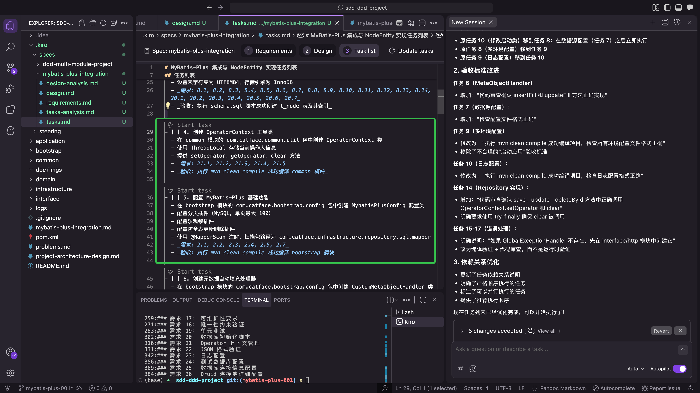

# 开发过程截图

本文档展示了在 Spec 开发过程中遇到的典型场景和问题的截图。

## Kiro 主动删除临时的验证文件

在开发过程中，Kiro 会主动识别并清理临时创建的验证文件，保持项目结构的整洁。

**说明**：
- Kiro 在验证完成后会自动清理临时文件
- 这体现了 Kiro 对项目结构的理解和维护能力
- 避免了手动清理临时文件的工作

## 任务中的验收标准过于简单

在任务拆分阶段，可能会出现验收标准过于简单或不够明确的情况。

**说明**：
- 验收标准应该具体、可执行、可测试
- 过于简单的验收标准会导致任务完成后难以验证
- 需要在任务拆分阶段就明确详细的验收标准
- 参考最佳实践：[任务拆分阶段最佳实践](../../.kiro/steering/03-tasks-planning-best-practices.md)

## 相关文档

- [常见问题与解决方案](../best-practice/problems.md)
- [任务拆分阶段最佳实践](../../.kiro/steering/03-tasks-planning-best-practices.md)
- [任务执行阶段最佳实践](../../.kiro/steering/04-tasks-execution-best-practices.md)
