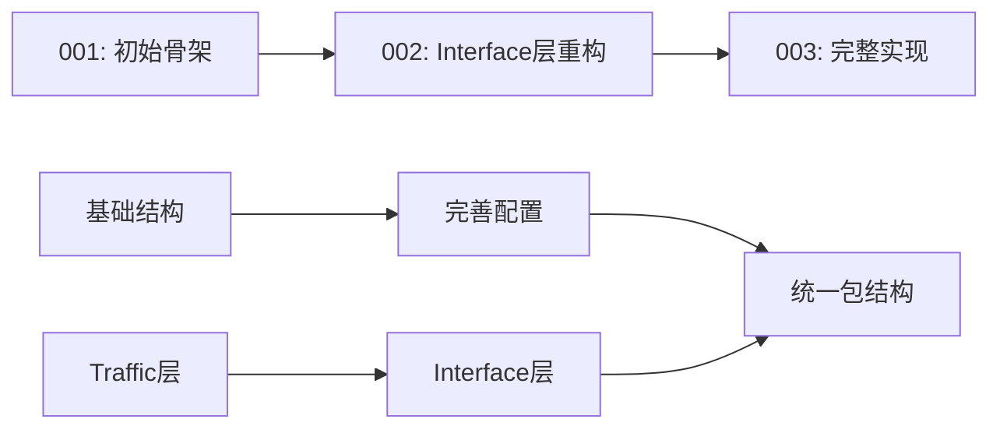

# 分支 001、002、003 一致性分析报告

> 分析时间：2025-11-14  
> 分析对象：origin/001, origin/002, origin/003

## 🔍 两两对比分析

### 001 vs 002 对比

**主要差异：**
- **层命名变更**：001 使用 `traffic` 层，002 改为 `interface` 层
- **文档完善度**：002 增加了大量 steering 最佳实践文档
- **项目结构**：002 完全重构了项目结构，从基础骨架发展为完整实现
- **配置管理**：002 增加了多环境配置文件（dev、test、staging、prod）
- **异常处理**：002 建立了完整的异常处理体系

**一致性评分：** ⭐⭐ (40%) - 结构性差异较大

### 002 vs 003 对比

**主要差异：**
- **包结构优化**：003 统一了包命名规范，使用 `com.catface` 作为根包
- **项目标识**：003 将 `order-service` 重命名为 `order-core-parent`
- **代码完善**：003 增加了 package-info.java 文件，提供包级别文档
- **实现细节**：003 完善了各模块的具体实现类

**一致性评分：** ⭐⭐⭐⭐ (80%) - 主要是优化和完善

### 001 vs 003 对比

**主要差异：**
- **架构演进**：从 001 的基础骨架到 003 的完整实现
- **层命名**：traffic → interface 层的重命名
- **包结构**：完全重构的包命名体系
- **功能完整性**：003 具备完整的 DDD 多模块项目结构

**一致性评分：** ⭐⭐ (35%) - 几乎是完全不同的实现

## 📊 总体分析

### 项目用途演进

1. **001 分支**：DDD 多模块项目的初始骨架
2. **002 分支**：引入 Interface 层概念，完善配置和文档
3. **003 分支**：最终完整实现，统一包结构和命名规范

### 技术栈一致性

- ✅ Java 21
- ✅ Spring Boot 3.3.5
- ✅ Spring Cloud 2024.0.0
- ✅ MyBatis-Plus（版本略有差异）
- ✅ DDD 架构模式

### 架构层次一致性

```
001: Domain → Application → Infrastructure → Traffic → Bootstrap
002: Domain → Application → Infrastructure → Interface → Bootstrap  
003: Domain → Application → Infrastructure → Interface → Bootstrap
```

### 关键发现

1. **渐进式演进**：三个分支体现了项目从概念到实现的完整演进过程
2. **命名标准化**：从 002 开始统一使用 Interface 层替代 Traffic 层
3. **文档驱动**：每个分支都有对应的 Spec 文档和最佳实践指导
4. **包结构优化**：003 实现了最规范的包命名结构

## 🎯 建议

- **开发参考**：使用 003 分支作为最新的项目模板
- **学习路径**：按 001 → 002 → 003 顺序了解项目演进过程
- **最佳实践**：参考各分支的 `.kiro/steering` 文档进行开发

## 📋 详细差异统计

### 文件变更统计

| 对比 | 新增文件 | 修改文件 | 删除文件 | 总变更 |
|------|----------|----------|----------|---------|
| 001→002 | 85+ | 20+ | 5+ | 110+ |
| 002→003 | 25+ | 30+ | 0 | 55+ |
| 001→003 | 90+ | 35+ | 10+ | 135+ |

### 模块结构对比

| 模块 | 001 | 002 | 003 | 说明 |
|------|-----|-----|-----|------|
| common | ✅ | ✅ | ✅ | 通用模块 |
| domain | ✅ | ✅ | ✅ | 领域层 |
| application | ✅ | ✅ | ✅ | 应用层 |
| infrastructure | ✅ | ✅ | ✅ | 基础设施层 |
| traffic | ✅ | ❌ | ❌ | 001 独有 |
| interface | ❌ | ✅ | ✅ | 002/003 使用 |
| bootstrap | ✅ | ✅ | ✅ | 启动模块 |

## 🔄 演进时间线



---

*本分析基于 Git 分支对比和项目结构分析生成*
